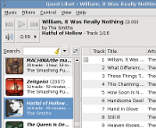

Projects
########

Things I'm working on..

Pure Python GObject Introspection Bindings
------------------------------------------

GTK+ bindings for CPython and PyPy

.. figure:: images/pgi.png
    :class: screenshot

* `Github page <https://github.com/lazka/pgi>`__

PyGObject API Documentation Generator
-------------------------------------

Auto generated Python API docs for GTK+ 3.0

.. figure:: images/pgi-docs.png
    :width: 200px
    :class: screenshot

* `Github page <https://github.com/lazka/pgi-docgen>`__
* `See in action <https://lazka.github.io/pgi-docs/>`__

Quod Libet / Ex Falso
---------------------

Audio library tagger, manager, and player for Linux / Windows

* `Google Code page <https://code.google.com/p/quodlibet/>`__

Mutagen
-------

Python multimedia tagging library

* https://mutagen.readthedocs.org/en/latest/

Old Projects
------------

GStreamer Crossfeed Plugin
    Gstreamer crossfeed plugin using the `bs2b library 
    <http://bs2b.sourceforge.net/>`__, created by Boris Mikhaylov.

    It's upstream now and part of GStreamer 1.6.

    GStreamer 0.10 verison on `Github <https://github.com/lazka/gst-bs2b>`__.

STM32 OS
    Scheduler, locks, framebuffer, newlib integration etc. for STM32 controllers.

    `GitHub page <https://github.com/lazka/stm32-hactar>`__

Rockbox Icons / Fonts
    Tango icon set (whoch is now the default) and a dejavu font package:

    :download:`Dejavu Font Pack <files/rockbox_dejavu-font-pack.tar.gz>`

    :download:`Tango Icon Theme <files/rockbox_tango-icons-12.tar.gz>`

IVTV Tray
    Simple app for controlling my Haupauge PVR150 TV card (and possibly all 
    ivtv cards). VLC is used to actually watch TV.

    :download:`Download <files/ivtv-tray.tar.gz>`

StudiVZ Sidebar
    Greasemonkeyscript which displays all your online friends in a sidebar with many features and fully configurable.

    Development page: `google code <http://code.google.com/p/svz-scripts/>`__ | `userscript.org <http://userscripts.org/scripts/show/13754>`__
