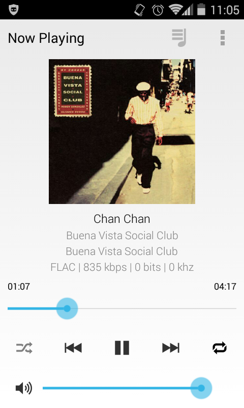
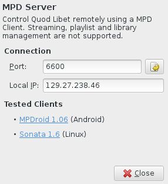

[2014-07] Quod Libet 3.2 - MPD Server
=====================================

It's again time for another Quod Libet release and this time I thought it 
might be nice to give an overview of all the new stuff that made it in.

New Android Remote Control / MPD Server Plugin
----------------------------------------------

This one was quite fun. Someone pointed out that it would be nice to have an 
Android remote control app, like Banshee and Clementine have nowadays. Since 
it isn't an easy undertaking to create and maintain an Android app I tried a 
few existing ones with the final goal to just re-implement the server side 
interface in QL and reuse the app for free. That's when I noticed that there 
are lots of `MPD <http://www.musicpd.org/>`__ clients available and even 
though the MPD protocol is probably overkill for a simple remote control, it 
guarantees us that there will always be a maintained client, given that mpd 
remains popular. There even might be a good client for iOS or Windows Phone, 
but I haven't looked into that.

In the end it turned out that even though there are lots of clients for 
Android, there is only one that's good enough and that's `MPDroid 
<https://play.google.com/store/apps/details?id=com.namelessdev.mpdroid>`__. 
It's luckily also the most popular one and actively maintained.

MPD exposes one main playlist, some non-main ones plus a library. The playing 
song has to be part of a playlist and changes to playlists need to be tracked 
and synced with the client. Because I didn't want to implement all this 
mapping between the mpd way and the QL one, I tricked the client into being a 
remote control only.

For this to work, QL exposes one playlist that only contains the active song. 
When the client tries to jump to the next one, QL changes the playlist by 
exchanging the song with the next one and marks it as playing. While this 
should theoretically work (say, a second client changed the playlist at the 
right/wrong moment), many clients get confused, stuck or crash. Luckily 
MPDroid does what we want in this case.

Another nice thing about MPDroid is that is uses the newer mpd 'idle' command 
which lets the client subscribe to events and wait until something happens. 
For this it opens an additional connection to the server which only listens 
for changes, while the first connection gets used for issuing commands like 
seeking. As a result both devices only have to wake up on song changes or if 
you change something in QL or MPDroid. No reason to switch it off if you don't 
use it anymore. Most other clients, including all GUI desktop clients I've 
tried, poll the server every second.

One thing which caught me by surprise a bit was MPDroid pausing the music 
while you receive a call on your phone. At first I thought QL was acting up, 
but it turned out to be a feature and not a bug :)

Setting it up
^^^^^^^^^^^^^

* Enable the 'MPD Server' plugin in QL. It will allow you to change the port, 
  but this is only needed if you run another mpd instance on your machine. The 
  displayed IP address is what you need to tell MPDroid. QL currently doesn't 
  support mpd password authentication, but this will probably be added for the 
  next version.

* MPDroid remembers one connection configuration per Wifi network. To set it 
  up go to ``Settings``, ``Connection Settings``, ``WLAN based connection`` 
  and select the Network you are currently connected to and set the ``Host`` 
  to the IP address shown in the QL plugin preferences.

.. figure:: images/mpdroid_settings.png
    :class: screenshot
    :width: 200px
    :align: right

It's not that much work, but if you switch your network regularly and get 
assigned a different IP each time this can get cumbersome.

For this case QL, like the real mpd, registers the mpd interface through 
`Avahi <https://en.wikipedia.org/wiki/Avahi_%28software%29>`__ (aka 
Zeroconf/Bonjour). This allows mpd clients on the same network to look for 
machines which provide a mpd interface and fetch the IP and port number. Sadly 
this `isn't implemented yet in MPDroid 
<https://github.com/abarisain/dmix/issues/576>`__ and also resolving the IP 
and port from the hostname doesn't work due to `shortcomings in Android 
<https://code.google.com/p/android/issues/detail?id=19550>`__. Once it is 
implemented though, no configuration will be needed in the common case and it 
will simply work once you connect both devices to the same network \*fingers 
crossed\*.
