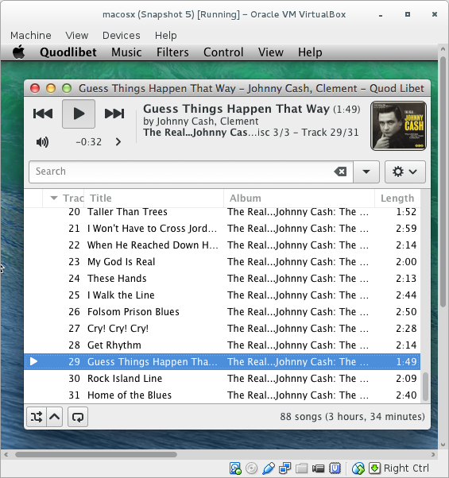
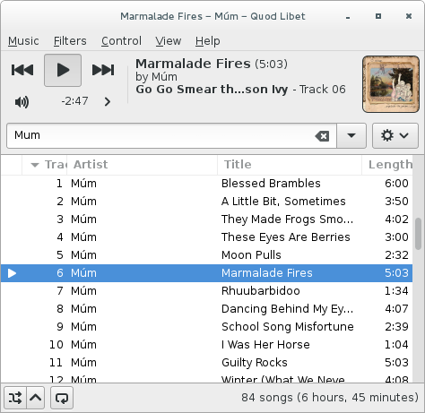
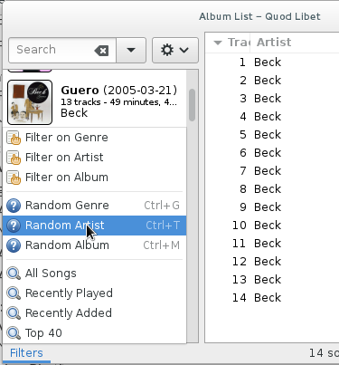
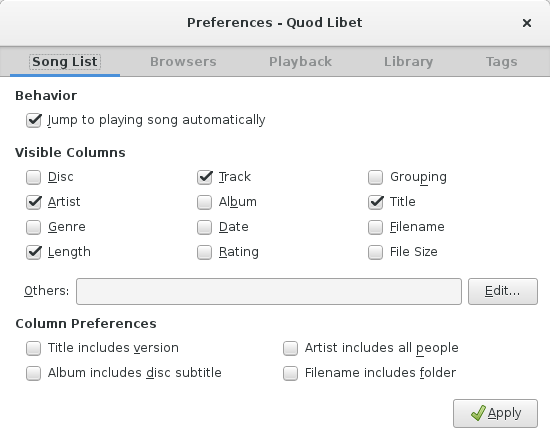
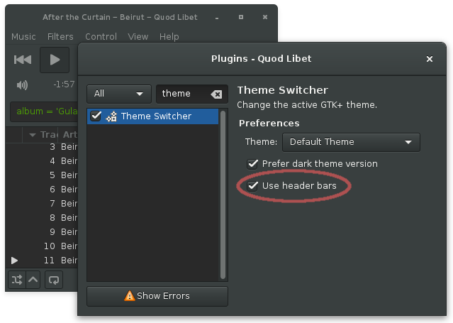
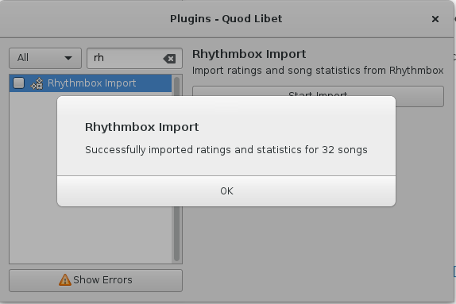
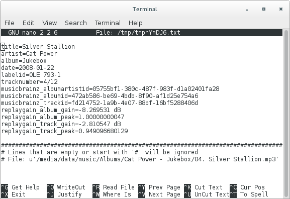
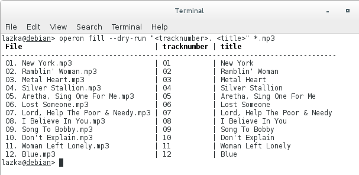
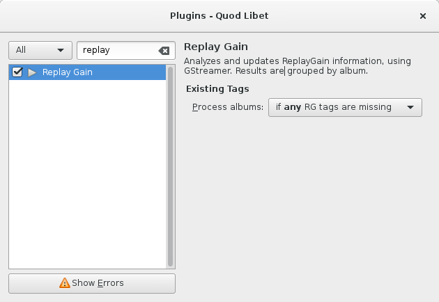
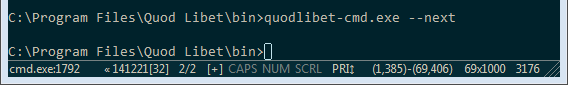

[2014-12] Quod Libet 3.3 Highlights
===================================

*(Quod Libet is a audio library tagger, manager, and player for Linux / Windows / OS X)*

Not that much, but anyway, here are some screenshots (also see the `full changelog 
<https://quodlibet.readthedocs.org/en/latest/changelog.html>`__):

-----

OS X support thanks to **Eric Le Lay** (https://github.com/elelay)

Download: https://quodlibet.readthedocs.org/en/latest/downloads.html#macosx

----

By default all text searches will match variants with diacritic marks.
Can also be enabled for exact searches and regex searches.

All of the below will find ``"Sigur Rós"``:

* ``Sigur Ros``
* ``"Sigur Ros"d``
* ``/Sigur Ros/d``

See the mapping: https://bpaste.net/show/0b334b0ec870

----

Secondary browser windows now have a filter menu as well and support the listed
accelerators.

----

Dialogs now use header bars (aka client side decoration) for consistency with 
builtin GTK+ dialogs. It's possible to disable this for Quod Libet alone using 
the "Theme Switcher" plugin.

----

.. figure:: images/lyricswindow.gif
    :class: screenshot
    :align: right
    :width: 350px

A new lyrics window plugin which shows LyricWiki lyrics in a WebKitGtk window.

-----

A simple Rhythmbox import plugin which transfers song statistics and ratings.

----

Two new operon commands:

* "edit":  for editing tags with a text editor
* "fill": for filling tags using parts of the file path

-----

.. figure:: images/programmatic_toggle.png
    :class: screenshot
    :align: right
    :width: 350px

Some small tagging improvements:

* Toggle programmatic tags in the editor (replaygain, musicbrainz)
* Possible to remove tags if some of the selected files don't support it.
* Multivalue support for some WMA tags

-----

.. figure:: images/coverart.png
    :class: screenshot
    :align: right
    :width: 350px

* Support for embedded images in Wavpack, Musepack and Monkey's Audio
* Quod Libet will now search all files in an album for embedded album art.
  As a result only one needs to have an image to be detected.

-----

The replaygain plugin gained an option to skip processing albums which are 
already tagged.

-----

.. figure:: images/sort_select.gif
    :class: screenshot
    :align: right
    :width: 350px

The song list will finally try to preserve the position during re-sorting.

-----

.. figure:: images/win_debug.png
    :class: screenshot
    :align: right
    :width: 350px

An additional Windows executable ``"quodlibet-cmd.exe"`` can be used in the 
command line and allows to send commands to the running instance 
(``"quodlibet-cmd.exe --start"`` for example).

Also Quod Libet will now always focus an existing application instance instead 
of starting a second one.
