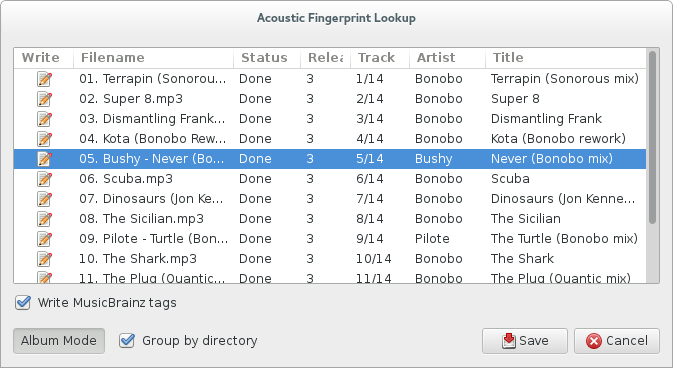
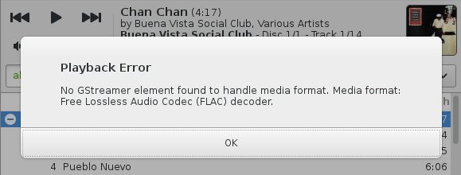
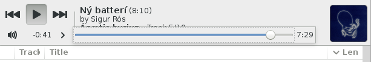
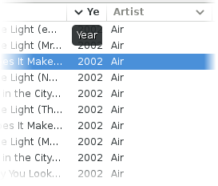

[2014-07] Quod Libet 3.2 Highlights
===================================

*(Quod Libet is a audio library tagger, manager, and player for Linux / Windows)*

Some changes in 3.2... (also see the `full changelog 
<https://quodlibet.readthedocs.org/en/latest/changelog.html>`__)

Acoustid Tagger
---------------

This is a basic implementation of automatic tagging using chromaprint and the 
`acoustid.org <https://acoustid.org/>`__ web service by Lukáš Lalinský. It's a 
bit all or nothing atm so either it detects all songs correctly or you have to 
fall back to the musicbrainz plugin.

It works with random tracks, multiple albums and incomplete albums.

Android Remote Control
----------------------

.. figure:: images/mpdroid.png
    :align: right
    :class: screenshot
    :width: 250px

.. figure:: images/mpdroid_settings.png
    :align: right
    :class: screenshot
    :width: 250px

Someone pointed out that it would be nice to have an Android remote control 
app, like Banshee and Clementine have nowadays. Since it isn't an easy 
undertaking to create and maintain an Android app I tried a few existing ones 
with the final goal to just re-implement the server side interface in QL and 
reuse the app for free. That's when I noticed that there are lots of `MPD 
<http://www.musicpd.org/>`__ clients available and even though the MPD 
protocol is a bit overkill for a simple remote control, it guarantees us 
that there will always be a maintained client, given that mpd remains popular. 
There even might be a good client for iOS or Windows Phone, but I haven't 
looked into that.

Since I didn't want to implement the whole playlist management, QL exposes one 
playlist with one song, which is the playing one. Every time the the active 
song changes, the playlist will be replaced, as if another MPD client did it.
The real client will resync if that happens and update its display.

For Android I'd recommend `MPDroid 
<https://play.google.com/store/apps/details?id=com.namelessdev.mpdroid>`__. I 
hadn't had any problems/crashes with it and it supports async notifications, 
so doesn't poll for changes all the time.

.. figure:: images/mpd_settings.png
    :class: screenshot

HiDPI Support
-------------

.. figure:: images/hidpi.png
    :class: screenshot
    :width: 400px

If you have a newer GTK+ and cairo trunk (some distros already ship it since 
there hasn't been a stable release in ages) you can start GTK+ apps with 
GDK_SCALE=2 and get a sharp and large version for displays with more DPI. This 
works for all existing GTK+ programs but can produce blurry images if the 
scale factor isn't taken into account by the program for loading/scaling 
images before passing them to GTK+. Quod Libet will now simply do that. Click 
on the image above to get a better impression.

GStreamer Error Reporting
-------------------------

QL used to save player errors for each song and jump to the next song 
immediately. This was confusing and annoying because the errors were not that 
helpful and the error stayed there until cleared manually.

Instead QL will now stop and show an error dialog with as much information 
about the error as possible. For example in the above picture it indicates 
that a FLAC decoder is missing.

Windows
-------

.. figure:: images/windows7.png
    :class: screenshot
    :width: 400px

This is how QL 3.2 looks like on Windows 7.

.. figure:: images/windows_context.png
    :class: screenshot

Right clicking on any folder now shows a menu entry that opens Ex Falso for 
that location. Or shift+right click on the active folder background.

Other Changes
-------------

.. figure:: images/playorder.png
    :class: screenshot

The play order combo box and repeat check box got replaced by two toggle 
buttons and a menu.

The seek bar now shows the remaining (or elapsed) time and gets wider for 
longer songs for more precise seeking.

It's now possible to hold down CTRL and sort by multiple columns. This 
replaces the multi sort dialog and also persists across restarts.
