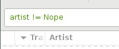
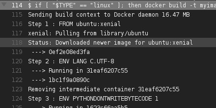
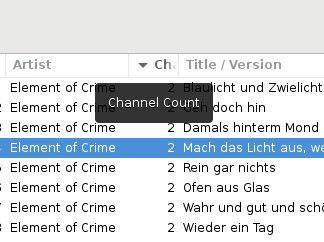
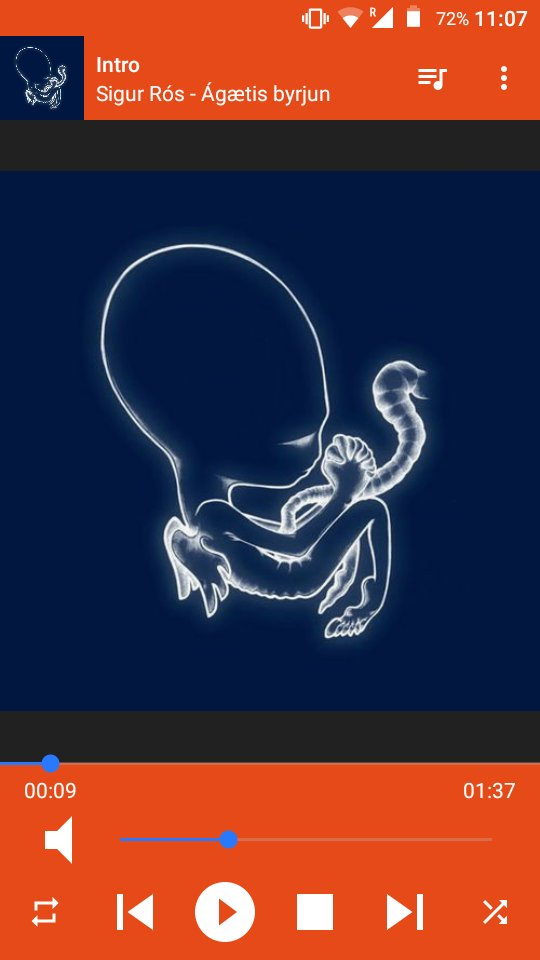
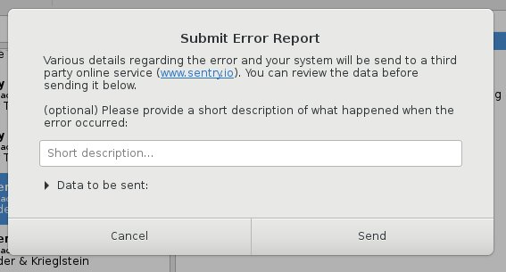
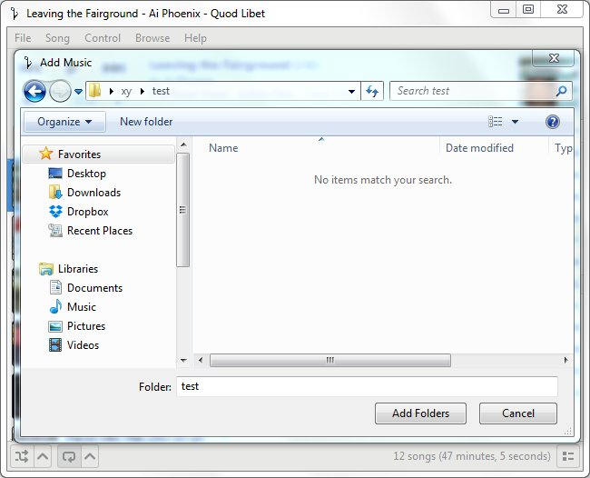
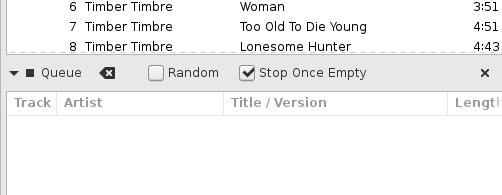
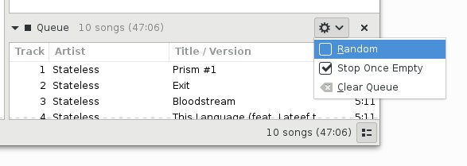

[2017-05] Quod Libet 3.9 Highlights
===================================

*(Quod Libet is a audio library tagger, manager, and player for Linux / Windows / macOS)*

For a detailed changelog see
https://quodlibet.readthedocs.io/en/latest/changelog.html#release-3-9-0

----

New plugin by @dvillevalois for only showing the menu bar when pressing Alt.
`https://github.com/quodlibet/quodlibet/pull/2263 <https://github.com/quodlibet/quodlibet/pull/2263>`__.

.. raw:: html

     <video controls loop="loop">
      <source src="../../_downloads/2017-02-28_11.03.50-836532357926645760-gif-video-1.mp4" type="video/mp4">
    </video> 

:download:`media/2017-02-28_11.03.50-836532357926645760-gif-video-1.mp4`

----

QL will now show you a stack trace on the next start in case it crashed.
`https://github.com/quodlibet/quodlibet/commit/64ee54fea156694844a720f9b11d78e2e95d64ad
<https://github.com/quodlibet/quodlibet/commit/64ee54fea156694844a720f9b11d78e2e95d64ad>`__

.. image:: media/2017-02-28_11.10.28-836534027096109056-1.jpg

----

Support for the "!=" operator in queries, by @ThirdDeclension
`https://github.com/quodlibet/quodlibet/commit/3083bf07835076e2742f7393fc9db0c5ca322d4b
<https://github.com/quodlibet/quodlibet/commit/3083bf07835076e2742f7393fc9db0c5ca322d4b>`__

----

We now run our tests on Ubuntu 14.04 and 16.04 on each commit, thanks to
travis-ci and docker `https://github.com/quodlibet/quodlibet/pull/2269
<https://github.com/quodlibet/quodlibet/pull/2269>`__

----

New "~#channels" tag exposing the channel count
`https://github.com/quodlibet/quodlibet/commit/720b339c306655bbb04970bbee4546647a6a0abb
<https://github.com/quodlibet/quodlibet/commit/720b339c306655bbb04970bbee4546647a6a0abb>`__

----

"~#encoding" now includes the lame encoding quality for MP3 files
`https://github.com/quodlibet/quodlibet/commit/1ea3eb3c45d5d9f31f6ebb1a54d9f8bf66e69d3e
<https://github.com/quodlibet/quodlibet/commit/1ea3eb3c45d5d9f31f6ebb1a54d9f8bf66e69d3e>`__

.. image:: media/2017-03-01_09.51.47-836876611840536578-1.jpg

----

Next QL will include a plugin for changing the user interface language
`https://github.com/quodlibet/quodlibet/pull/2154
<https://github.com/quodlibet/quodlibet/pull/2154>`__

.. raw:: html

     <video controls loop="loop">
      <source src="../../_downloads/2017-03-01_09.57.21-836878012431888384-gif-video-1.mp4" type="video/mp4">
    </video> 

:download:`media/2017-03-01_09.57.21-836878012431888384-gif-video-1.mp4`

----

Since 3.8.1 our MPD plugin also works with the M.A.L.P. Android client
`https://github.com/gateship-one/malp
<https://github.com/gateship-one/malp>`__

----

New bpm tap plugin, by @dvillevalois
`https://github.com/quodlibet/quodlibet/pull/2264
<https://github.com/quodlibet/quodlibet/pull/2264>`__

.. raw:: html

     <video controls loop="loop">
      <source src="../../_downloads/2017-03-01_10.21.07-836883996348977153-gif-video-1.mp4" type="video/mp4">
    </video> 

:download:`media/2017-03-01_10.21.07-836883996348977153-gif-video-1.mp4`

----

The waveform seekbar now looks better in HiDPI mode
`https://github.com/quodlibet/quodlibet/pull/2261
<https://github.com/quodlibet/quodlibet/pull/2261>`__

.. image:: media/2017-03-01_19.40.47-837024840976633864-1.jpg

----

Next Quod Libet will send errors and crashes to https://sentry.io . Thanks
@getsentry

----

Panes in the paned browser can now be resized.
`https://github.com/quodlibet/quodlibet/pull/2301
<https://github.com/quodlibet/quodlibet/pull/2301>`__

.. raw:: html

     <video controls loop="loop">
      <source src="../../_downloads/2017-03-14_15.55.47-841679257101316097-gif-video-1.mp4" type="video/mp4">
    </video> 

:download:`media/2017-03-14_15.55.47-841679257101316097-gif-video-1.mp4`

----

Some grouping for our evergrowing list of plugins.
`https://github.com/quodlibet/quodlibet/pull/2218
<https://github.com/quodlibet/quodlibet/pull/2218>`__

.. raw:: html

     <video controls loop="loop">
      <source src="../../_downloads/2017-03-17_19.16.58-842817051643252737-gif-video-1.mp4" type="video/mp4">
    </video> 

:download:`media/2017-03-17_19.16.58-842817051643252737-gif-video-1.mp4`

----

Native file chooser dialogs on Windows.
`https://github.com/quodlibet/quodlibet/pull/2324
<https://github.com/quodlibet/quodlibet/pull/2324>`__

----

New checkbox for stopping after the queue runs out:
`https://github.com/quodlibet/quodlibet/pull/2340
<https://github.com/quodlibet/quodlibet/pull/2340>`__

----

Making things ready for a new release. Some changes the queue UI

