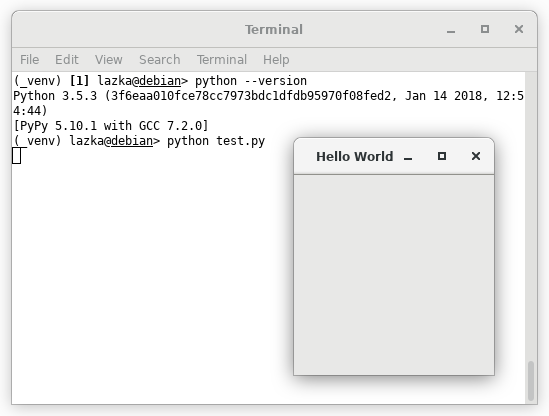
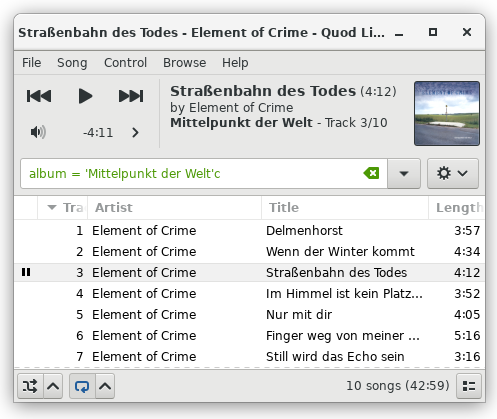

PyPy & PyGObject
----------------

You can now run applications using `PyGObject
<https://pygobject.readthedocs.io>`__ with `PyPy <http://pypy.org/>`__. This
requires PyPy(2/3) 5.10+ and (for now) PyGObject master and makes it possible
to use libraries such as `GTK+ <https://www.gtk.org/>`__, `GStreamer
<https://gstreamer.freedesktop.org/>`__ and `WebKitGTK+
<https://webkitgtk.org/>`__ with PyPy.

.. note::

    Things are currently slower and use more memory than with CPython. I have
    only focused on getting the pycairo and pygobject test suites to pass for
    now.

First we set up the basics with PyPy3:

.. code:: shell

    ./pypy3/bin/pypy -m venv _venv
    source _venv/bin/activate
    python -m pip install pycairo  # pycairo also supports PyPy now
    python -m pip install git+https://gitlab.gnome.org/GNOME/pygobject.git

Let's try the `first GTK+ example
<https://pygobject.readthedocs.io/en/latest/getting_started.html>`__ from the
PyGObject tutorial:

.. code:: shell

    python test.py

Something more complex, a `music player
<https://quodlibet.readthedocs.io>`__ written in Python:

.. code:: shell

    python -m pip install mutagen feedparser
    git clone https://github.com/quodlibet/quodlibet.git
    python quodlibet/quodlibet/quodlibet.py

And finally, an interactive `matplotlib <https://matplotlib.org/>`__ example:

.. code:: shell

    python -m pip install matplotlib
    curl -O https://raw.githubusercontent.com/matplotlib/matplotlib/master/examples/event_handling/path_editor.py
    python path_editor.py

.. image:: path_editor.gif
    :width: 400px
    :align: center

Everything just works 😁

If something doesn't please file a bug:
https://gitlab.gnome.org/GNOME/pygobject
